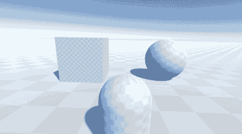
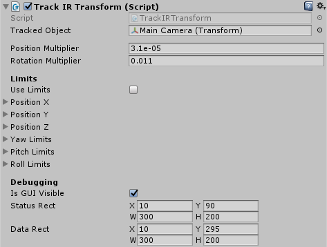
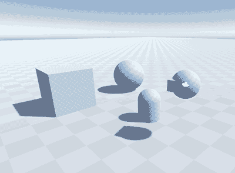

# Unity TrackIR Plugin v1.1

As I started to integrate the old Track IR plugin code into a small test project, I ended up re-writing a lot how it interfaces with Unity. This new version includes a bunch of quality of fixes and re-organizes the code into something that more closely matches how Unity code is written today.

The original code is quite old and originally built for Unity 2.6!

The TrackIR plugin [was originally written by Tobias Boogh](https://github.com/byBrick/Unity-TrackIR-Plugin), and [updated by Chris Reed](https://github.com/chrisreedio/Unity-TrackIR-Plugin/tree/x86_64) with 64 bit binaries required for recent versions of Unity.

This project was built in **Unity 2017.4.37f1**

## Download

You can either clone the repository or [download the asset package](https://github.com/brihernandez/Unity-TrackIR-Plugin/raw/master/TrackIRTransform.unitypackage) located in the root.

## How it works

The `TrackIRTransform` component takes raw input from TrackIR, and then modifies the assigned `Tracked Object` to mirror those inputs in **local space**. All inputs are also offset from wherever the object already was in local space, so you can have an object at some position, E.g. (0, 1, 3) with a rotation of (30, 0, 0) and all movement/rotation will be done relative to those offsets.

**Important!:** Since movement is handled in local space, TrackIR positional offsets do not work correctly if the `Tracked Object` is not facing forwards.

The default values for the `Position Multiplier` and `Rotation Multiplier` are magic numbers that I've found to make the Unity results match 1:1 what the TrackIR application reports the results *should* be. I've left them configurable either way in case it they need to be adjusted.

Behind the scenes, these values are multipliers to the raw hardware values that TrackIR puts out.

## Usage

Tracking will start automatically, but can be enabled or disabled at runtime using either the `StartTracking()` and `StopTracking()` functions, or by enabling/disabling the component itself. The latter should be negligibly more performant since it won't be running an `Update()` loop that isn't doing anything while disabled, but the methods are otherwise identical.

I've also included a simple `ResetTracking()` utility function because sometimes I forget to start up TrackIR and it's always annoyed me that most games need to be completely restarted for TIR to work in that situation.

This is typical hierarchy I would use for a tracked camera, with the `TrackIRTransform` component on the "TrackIR" object, and the "Main Camera" set as the `Tracked Object`. Depending on how you plan to use your cameras, you might be able get away with not having that root component, but the important thing to remember is that all rotation and movement is handled in local space. Without that root object, the camera rotation will work correctly only if local rotation is straight forward.

Optional clamps on position and rotation can be applied by checking the `Use Limits` box.

## Changelog

### 1.1. (Apr 3 2020)

- Fixed crash when TrackIR is not detected at all

### 1.0 (Apr 2 2020)

- Released
